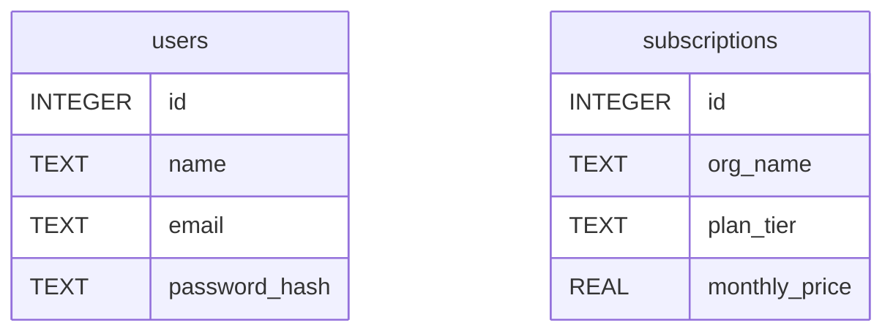

#  Database Co-Pilot — Universal MCP Server

> **BOSS Console Hackathon Submission (EXTEND Track)**  
 

Database Co-Pilot is a secure, multi-engine Model Context Protocol (MCP) server built with **FastMCP** and **SQLAlchemy**. It transforms AI agents into developer-focused database administrators, enabling safe schema exploration, full-stack type generation (TypeScript & Pydantic v2), query performance analysis, and read-only data querying with automated PII masking.

---

##  Problem & Solution

Giving AI agents raw, unconstrained database access poses major risks:
1. **Accidental Data Loss:** Unrestricted write access can lead to destructive operations (`DROP`, `DELETE`, `UPDATE`).
2. **PII & Data Leaks:** Sensitive customer fields (emails, passwords, API tokens) can contaminate LLM context windows and training logs.
3. **Developer Friction:** Hand-writing TypeScript interfaces or Pydantic models from database schemas takes manual effort and introduces typing bugs.

**Database Co-Pilot solves this by inserting a secure, intelligent abstraction layer between the AI agent and your database.**

---
### Prerequisites in BOSS Console
* BOSS Console installed and configured with an active Gemini API key.

  
##  Key Features & MCP Tools

| Tool Name | Engine Support | Description |
| :--- | :--- | :--- |
| `get_schema_diagram` | Any SQL Engine | Generates visual Mermaid.js ER diagrams of tables, columns, and data types for instant chat rendering. |
| `generate_typescript_types` | Any SQL Engine | Inspects column metadata and emits type-safe TypeScript `interface` definitions for frontend apps. |
| `generate_pydantic_models` | Any SQL Engine | Generates Python Pydantic v2 `BaseModel` classes mapped directly to table schemas for backend APIs. |
| `explain_query_plan` | Dialect-Aware | Runs `EXPLAIN` / `EXPLAIN QUERY PLAN` commands to help developers debug slow queries and indexes. |
| `run_read_query_markdown` | Any SQL Engine | Safely executes `SELECT` queries, formats output into Markdown tables, and applies automated cell-level PII masking. |

---

##  Enterprise Security & Guardrails

* **Read-Only Enforcement:** Strictly blocks non-`SELECT` statements (`DELETE`, `DROP`, `UPDATE`, `INSERT`, `ALTER`) at the tool entry point.
* **Automated PII Redaction:** The `mask_sensitive_data` engine inspects query outputs cell-by-cell before returning results:
  * **Emails:** Masked to `a***@domain.com` format.
  * **Secrets & Credentials:** Fields matching `password`, `secret`, `token`, `ssn`, or `credit_card` are converted to `********`.
* **Path Traversal Protection:** Enforces filename sanitization via `os.path.basename` to prevent unauthorized file system traversal.
* **Universal Database Support:** Built on **SQLAlchemy**, supporting zero-setup local SQLite databases (`dev.db`, `saas.db`) alongside enterprise SQL connections (`postgresql://`, `mysql://`, `mssql://`).

---

##  Repository Structure

```text
my-boss-project/
├── db_explorer.py          # Core MCP server implementation (FastMCP + SQLAlchemy)
├── test_db_explorer.py     # 9-case pytest validation suite
├── dev.db                  # Primary sample dataset (Users, Products)
├── saas.db                 # Secondary sample dataset (Subscriptions, Billing)
├── requirements.txt        # Production dependencies
└── README.md               # Architecture documentation & visual output previews
```

---

##  Installation & Quickstart

### 1. Prerequisites
* Python 3.10 or higher installed.
* Git installed.

### 2. Clone Repository & Set Up Virtual Environment

```bash
# Clone the repository
git clone [https://github.com/Siddhu0207/my-boss-project.git](https://github.com/Siddhu0207/my-boss-project.git)
cd my-boss-project

# Create a virtual environment
python3 -m venv venv

# Activate the virtual environment
# On macOS / Linux:
source venv/bin/activate
# On Windows:
# .\venv\Scripts\Activate.ps1
```

### 3. Install Dependencies

Upgrade `pip` and install all required Python packages listed in `requirements.txt`:

```bash
pip install --upgrade pip
pip install -r requirements.txt
```

### 4. Run Automated Unit Tests

Execute the automated `pytest` suite to verify read-only guardrails, PII redaction, dynamic database targeting, and model generators:

```bash
pytest test_db_explorer.py -v
```

### 5. Launch the MCP Server

Start the Database Co-Pilot server using direct Python execution or launch the interactive FastMCP developer inspector:

```bash
# Direct execution
python3 db_explorer.py

# Or launch with the FastMCP interactive browser inspector UI
fastmcp dev db_explorer.py
```

---

##  Sample Tool Outputs

### 1. Schema ER Diagram (`get_schema_diagram`)

Generates visual Mermaid.js ER diagrams of database tables, column names, and data types for instant rendering:



---

### 2. Full-Stack Code Generation

Inspects column metadata and emits type-safe models for both frontend and backend development:

#### TypeScript Interfaces (`generate_typescript_types`)

```typescript
export interface User {
  id: number;
  name: string;
  email: string;
  password_hash: string;
}

export interface Subscription {
  id: number;
  org_name: string;
  plan_tier: string;
  monthly_price: number;
}
```

#### Python Pydantic v2 Models (`generate_pydantic_models`)

```python
from pydantic import BaseModel
from typing import Optional

class User(BaseModel):
    id: int
    name: str
    email: str
    password_hash: str

class Subscription(BaseModel):
    id: int
    org_name: str
    plan_tier: str
    monthly_price: float
```

---

### 3. Safe Query Execution with Automated PII Masking (`run_read_query_markdown`)

Safely executes `SELECT` queries, formats output into clean Markdown tables, and automatically redacts sensitive customer data (emails, passwords, secret tokens) cell-by-cell:

**Input Query:** `SELECT id, name, email, password_hash FROM users;`

**Output:**  
*Target Database:* `dev.db`

| id | name | email | password_hash |
| :--- | :--- | :--- | :--- |
| 1 | Alice Johnson | a***@example.com | ******** |
| 2 | Bob Smith | b***@example.com | ******** |

---

### 4. Query Plan Analysis (`explain_query_plan`)

Runs dialect-aware `EXPLAIN` / `EXPLAIN QUERY PLAN` commands to help developers debug slow queries and inspect index performance:

**Input Query:** `SELECT * FROM subscriptions WHERE plan_tier = 'Enterprise';`

**Output:**  
*Target Database:* `saas.db` (Engine: SQLite)

```text
Query Execution Plan:
- SCAN TABLE subscriptions
```

---

##  Verification & Test Results

The repository includes an automated 9-case test suite powered by `pytest` to verify security guardrails (blocking `DELETE`/`DROP`), PII masking engines, schema diagrams, code generators, and dynamic database routing.

Run the test suite locally:

```bash
pytest test_db_explorer.py -v
```

**Passing Test Logs:**

```text
test_db_explorer.py::test_select_query_allowed PASSED                   [ 11%]
test_db_explorer.py::test_security_guardrail_blocks_delete PASSED       [ 22%]
test_db_explorer.py::test_security_guardrail_blocks_drop PASSED         [ 33%]
test_db_explorer.py::test_pii_masking_logic PASSED                      [ 44%]
test_db_explorer.py::test_get_schema_diagram PASSED                     [ 55%]
test_db_explorer.py::test_generate_typescript_types PASSED              [ 66%]
test_db_explorer.py::test_generate_pydantic_models PASSED              [ 77%]
test_db_explorer.py::test_explain_query_plan PASSED                     [ 88%]
test_db_explorer.py::test_multi_db_dynamic_target PASSED                 [100%]

============================== 9 passed in 0.12s ==============================
```
